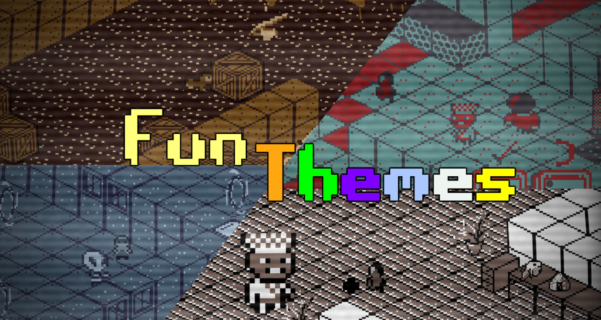

# BingerNinja

Binger Ninja was created by a group of third year university students during the Covid-19 pandemic, throughout this entire process they have only communicated online.
Binger Ninja is a 2D isometric action RPG in which the player controls an overweight ninja who's sole goal is to get to the top of the tower to save Tadashi's daughter. 

Play it for free: https://jonthebluecow.itch.io/binger-ninja

